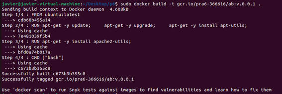

Arquitectura de servicios red
# PRÁCTICA 6 - Estrategias de autoescalado con K8s
Autor:
* Javier Álvarez Martínez  
---
## Creación del clúster de kubernetes

En primer lugar se va a crear un clúster de K8s que sirva un servicio webserver de apache. Los pasos que se deben realizar son los siguientes:

Lo primer que se va a realizar es un gcloud init para conectarnos con el proyecto que tenemos en el cloud. La forma de realizarlo es la siguiente:


A continuación, se va a cargar la configuración inicial del clúster, almacenado en el fichero de configuración. La información de este fichero es la siguiente:

 ``` ini
 zone="europe-west1-b"
cluster_name="scaling-demo"
php_deployment="php-apache"
php_manifest="php-apache.yaml"
min_replicas=1
max_replicas=10
cpu_threshold=50
min_nodes=1
max_nodes=5
```

Para cargar la información de dicho archivo se realizará lo siguiente:


Lo siguiente es iniciar nuestro clúster de kubernetes en Google. 


La respuesta del comando anterior es la siguiente:


Para demostrar el autoescalado horizontal de pods vamos a desplegar una imagen de docker basada en php-apache. Ésta servirá un index.php que lleva a cabo tareas computacionalmente costosas. El archivo es el siguiente:

``` yaml
 apiVersion: apps/v1
kind: Deployment
metadata:
  name: php-apache
spec:
  selector:
    matchLabels:
      run: php-apache
  replicas: 3
  template:
    metadata:
      labels:
        run: php-apache
    spec:
      containers:
      - name: php-apache
        image: k8s.gcr.io/hpa-example
        ports:
        - containerPort: 80
        resources:
          limits:
            cpu: 500m
          requests:
            cpu: 200m
---
apiVersion: v1
kind: Service
metadata:
  name: php-apache
  labels:
    run: php-apache
spec:
  ports:
  - port: 80
  selector:
    run: php-apache
```
Ahora se aplicará dicho manifiesto al clúster


Lo siguiente es ver los despliegues que se encuentran en funcionamiento en el clúster


HPA (o autoescalado horizontal de pods) se encarga de modificar la estructura de nuestro cluster mediante el incremento o decremento automático del número de pods en respuesta a la carga CPU de trabajo que haya, o al consumo de memoria, o en respuesta a ciertas métricas personalizadas que son monitorizadas por K8s y que podemos usar como indicadores de un cambio de régimen.

Lo primero es configurar el autoescalado horizontal de pods de la siguiente forma


Ahora se procede a comprobar el estado del HPA


Lo siguiente es configurar el autoescalado del clúster. Se realizará de la siguiente manera:


Lo último es cambiar a un perfil de autoescalado de la siguiente manera:


Finalmente se comprueban los nodos disponibles para usar:


## Entrega 2

lo primero es configurar el fichero Dockerfile que contiene la imagen Docker

```Dockerfile
FROM ubuntu:latest

RUN apt-get -y update; /
    apt-get -y upgrade; /
    apt-get -y install apt-utils;
RUN apt-get -y install apache2-utils;

CMD ["bash"]
```

Lo siguiente es taggear la imagen al registry de Google



A continuación, se comprueban los Docker existentes


Se sube la imagen a Google


Lo siguiente es almacenar el archivo job.yaml

```yaml
apiVersion: batch/v1beta1
kind: CronJob
metadata:
  name: mycronjob
spec:
  schedule: "*/10 * * * *"
  jobTemplate:
    spec:
      template:
        spec:
          containers:
          - name: ab
            image: gcr.io/pra6-366616/ab:v.0.0.1
            command: ["ab","-n","10000","-c","10","http://php-apache/"]
          restartPolicy: Never
      backoffLimit: 2
  
  concurrencyPolicy: Allow 
  ```

Finalmente se lanza el comando que ejecuta el job.yaml


El resultado es el siguiente:


## Entrega 3

En primer lugar se debe activar Cloud Build Kubernetes Engine Google App Engine Admin API Cloud Storage de la siguiente forma:


Lo siguiente es construir la imagen Docker y subirla al contenedor.


La salida del comando es la siguiente:


Lo siguiente es modificar el fichero locust master controller:

```yaml
# Copyright 2015 Google Inc. All rights reserved.
#
# Licensed under the Apache License, Version 2.0 (the "License");
# you may not use this file except in compliance with the License.
# You may obtain a copy of the License at
#
#     http://www.apache.org/licenses/LICENSE-2.0
#
# Unless required by applicable law or agreed to in writing, software
# distributed under the License is distributed on an "AS IS" BASIS,
# WITHOUT WARRANTIES OR CONDITIONS OF ANY KIND, either express or implied.
# See the License for the specific language governing permissions and
# limitations under the License.


apiVersion: "apps/v1"
kind: "Deployment"
metadata:
  name: locust-master
  labels:
    name: locust-master
spec:
  replicas: 1
  selector:
    matchLabels:
      app: locust-master
  template:
    metadata:
      labels:
        app: locust-master
    spec:
      containers:
        - name: locust-master
          image: gcr.io/practica6-366709/locust-tasks:latest
          env:
            - name: LOCUST_MODE
              value: master
            - name: TARGET_HOST
              value: http://php-apache
          ports:
            - name: loc-master-web
              containerPort: 8089
              protocol: TCP
            - name: loc-master-p1
              containerPort: 5557
              protocol: TCP
            - name: loc-master-p2
              containerPort: 5558
              protocol: TCP
```

Y el fichero locust worker controller quedaría:

```yaml
# Copyright 2015 Google Inc. All rights reserved.
#
# Licensed under the Apache License, Version 2.0 (the "License");
# you may not use this file except in compliance with the License.
# You may obtain a copy of the License at
#
#     http://www.apache.org/licenses/LICENSE-2.0
#
# Unless required by applicable law or agreed to in writing, software
# distributed under the License is distributed on an "AS IS" BASIS,
# WITHOUT WARRANTIES OR CONDITIONS OF ANY KIND, either express or implied.
# See the License for the specific language governing permissions and
# limitations under the License.

apiVersion: "apps/v1"
kind: "Deployment"
metadata:
  name: locust-worker
  labels:
    name: locust-worker
spec:
  replicas: 5
  selector:
    matchLabels:
      app: locust-worker
  template:
    metadata:
      labels:
        app: locust-worker
    spec:
      containers:
        - name: locust-worker
          image: gcr.io/practica6-366709/locust-tasks:latest
          env:
            - name: LOCUST_MODE
              value: worker
            - name: LOCUST_MASTER
              value: locust-master
            - name: TARGET_HOST
              value: http://php-apache
```
A continuación, se debe desplegar los locust master, el worker y el servicio.


Finalmente se muestran los resultados de las pruebas realizadas.

Primeramente las muestras para número máximo de replicas de pods de 10


Para un número máximo de réplicas de 50 pods los resultados son los siguientes:


Como se puede ver el número de rquests por segundo (rps) es mayor cuando mayor es el número de réplicas de pods permitidos. Además, si dejamos correr la prueba el mismo número de tiempo el porcentaje de error es menor.


